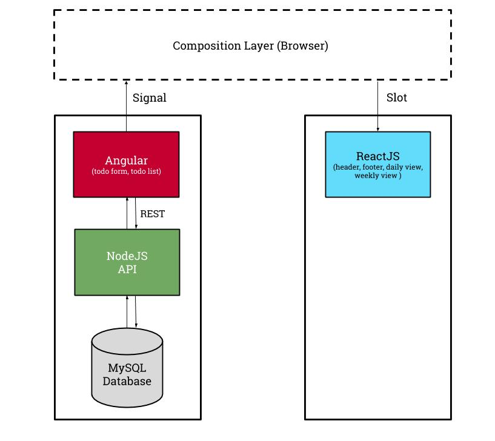
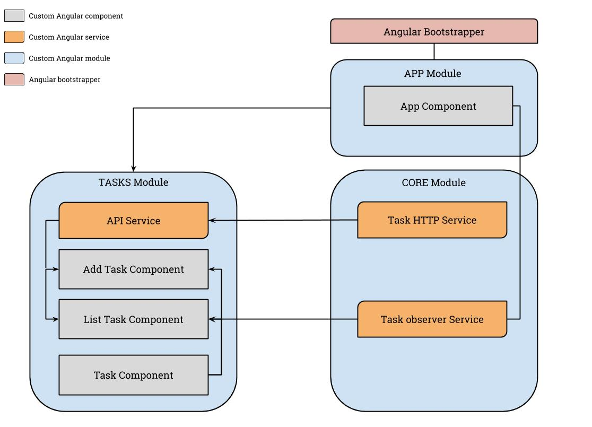
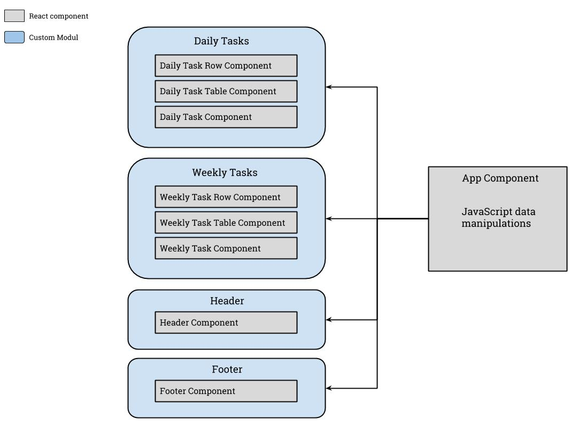

# angular-react-microfrontend
microfrontend demo using Angular and React alongs with a NodeJS API

# 🎨 Stack

- Persistence store: [MySQL](https://www.mysql.com/)
- ORM: [TypeORM](http://typeorm.io/#/)
- Backend: [Node.js](https://nodejs.org/en/)
- Frontend: [Angular](https://angular.io/) 11 and [ReactJS](https://reactjs.org/)
- CSS based on [Twitter's bootstrap](https://getbootstrap.com/)

# 🏗️ Global architecture



## Angular app modules view



## React app component structure



# 🔧 Installation

Adjust persistence settings with your local configuration. Just Change host and port and the database name inside the `ormconfig.json` located at `src/server/ormconfig.json`.

```json
{
    "type": "mysql",
    "host": "localhost",
    "port": 3306,
    "username": "root",
    "password": "",
    "database": "microfrontends",
    "synchronize": true,
    "entities": [
        "api/entities/*.ts"
    ],
    "subscribers": [
        "api/subscribers/*.ts"
    ],
    "migrations": [
        "api/migrations/*.ts"
    ],
    "cli": {
        "entitiesDir": "api/entities",
        "migrationsDir": "api/migrations",
        "subscribersDir": "api/subscribers"
    }
}
```

# 🏃 Running

## Start the Server

- Start your _MySQL_ Database
- Run the server

Open your terminal and run following commands:

```bash
$ cd src/server
$ npm install or yarn install
$ npm run dev or yarn dev
```

- Run the client

```bash
$ cd src/client/todolist
$ npm install or yarn
$ npm run build:elements or yarn build:elements
$ cd ..
$ cd todo-details
$ npm install or yarn
$ npm run start or yarn start
```

- Browse to the application at [http://localhost:3000](http://localhost:3000)

# :rotating_light: Run Tests

## Run NodeJS Tests

```bash
$ cd src/server/
$ npm run test or yarn test
```

## Run Angular Tests

```bash
$ cd src/client/todolist
$ npm run test or yarn test
```

## Run ReactJS Tests

```bash
$ cd src/client/todo-details
$ npm run test or yarn test
```


# 📄 Licence

Built with all :heart: of the world by [Billy Lando](https://github.com/billyjov).

MIT License (MIT) © [Billy Lando](https://github.com/billyjov)
